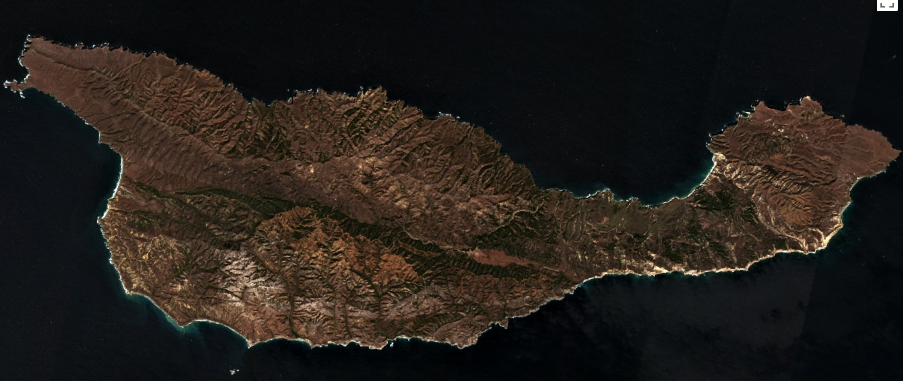

## Image classification in Google Earth Engine with topographic and spectral variables
[**Zach Levitt**](https://zachlevitt.github.io), '20.5</br>
[**Jeff Howarth**](https://jeffhowarth.github.io/), Associate Professor of Geography</br>
Middlebury College, Vermont, USA

### Introduction

This tutorial outlines a workflow for classifying remotely-sensed imagery in Google Earth Engine (GEE) using machine learning models trained on topographic and spectral variables. Using a combination of pre-loaded GEE satellite imagery and analysis methods, as well as topographic variables, we describe the steps to implement an image classification methodology in GEE. We utilize supervised classification methods and demonstrate various methods for improving the accuracy and efficiency of the workflow. While we apply these methods to classify vegetation on the Channel Islands of California, our module functions and the general workflow are applicable to a wide range of use cases. 

<!-- The tutorial has been broken down into major tasks that you can pick and choose to fit your particular use case. 

***Note regarding code structure*** -->

In order to increase the usability of our code, we use modules to define functions that can be applied to any case study. GEE [Modules](https://medium.com/google-earth/making-it-easier-to-reuse-code-with-earth-engine-script-modules-2e93f49abb13) are helpful for producing reusable code and allow anyone to reference pre-defined functions with their own inputs. You can reference these functions in your script or modify them to fit your context and create your own module script. This [tutorial](./modules.md) offers descriptions of the module functions. To connect to the module functions defined [here](https://code.earthengine.google.com/9ef0eb7a802163ba97e51a94a754379d), add this line at the top of your script:

```javascript
var ct = require('users/zlevitt/chis:chisTools.js');
```

The code snippets below are from the [**completed script**](https://code.earthengine.google.com/ba0f64848eddfbce06369aa8cdbe21be), which applies these methods to classify vegetation on Santa Cruz Island.
<!-- 
If you have never used GEE before, here is a helpful place to start: [https://jeffhowarth.github.io/eeprimer/start/getGEE/](https://jeffhowarth.github.io/eeprimer/start/getGEE/) -->

### What are the aspects of this tutorial?

1. [**Data inputs and pre-processing**](#upload-or-import-data)
	1. [Satellite imagery](#satellite-imagery) (NAIP, Sentinel, etc.)
	2. [Elevation data](#elevation-data) (Upload or import from GEE)
	3. [Define global variables](#define-global-variables)
2. [**Calculate spectral and topographic variables**](#calculate-spectral-and-topographic-variables)
	* [Spectral variables](#spectral-variables)
		* Spectral indices (image bands)
		* Ratio indices
			* Normalized Difference Vegetation Index (NDVI)
			* Burn index ratio
			* Other band ratios
	* [Topographic variables](#topographic-variables)
		* Canopy height (only possible with elevation and surface models)
		* Heat load index
		* Topographic position index (TPI)
		* Mean TPI
		* Slope 
3. [**Set up and apply classification methods**](#set-up-and-apply-classification-methods)
	* [Create image stack with bands and variables](#create-image-stack-with-bands-and-variables)
	* [Create training and validation geometries using stratified sampling](#create-training-and-validation-geometries-using-stratified-sampling)
	* [Filter training and validation data](#filter-training-and-validation-data)
	* [Random Forest classification](#random-forest-classification)
4. [**Evaluate and visualize results**](#evaluate-and-visualize-results)
	* [Confusion matrix](#confusion-matrix)
	* [Variable importance](#variable-importance)
	* [Visualization parameters](#visualization-parameters)
	* [Export data](#export-data)

###Upload or import data

To perform image classification with topographic variables, there are two necessary inputs:

####**Satellite imagery** 

Depending upon your study area and end goals, there are several options for satellite imagery housed within GEE. 
National Agricultural Imagery Program (NAIP) and Sentinel data both offer benefits and drawbacks for this type of analysis. NAIP imagery is much higher-resolution (1-meter compared to 10-meter for Sentinel) yet it is possible to calculate seasonal differences with Sentinel, while NAIP does not have enough imagery to allow for this type of analysis.

```javascript
//Constants
var outScale = 10;
var outCRS = 'EPSG:32611'
var startDateWinter = '2019-02-15';
var endDateWinter = '2019-03-15';
var startDateSummer = '2019-08-01';
var endDateSummer = '2019-09-30';
var cloudPercentage = 0.2;

//We will utilize two time periods for Sentinel data
var sentinelWinter = ct.loadSentinel(extent,startDateWinter,endDateWinter,cloudPercentage);
var sentinelSummer = ct.loadSentinel(extent,startDateSummer,endDateSummer,cloudPercentage);
```

####**Elevation data** 

There are several options for elevation data in GEE, including Shuttle Radar Topography Mission (SRTM) and USGS National Elevation Dataset (NED). These options offer national (USGS NED) or global (SRTM) elevation rasters, but unfortunately there is no surface model available for this data. In this tutorial, we use our own elevation data from LiDAR, which is not included in Earth Engine. If you have available LiDAR data for your study region, you can upload GeoTIFFs as assets to Earth Engine by clicking on the **Assets** tab, then the **New** button, and upload your GeoTIFF.

The following code offers modules for loading a LiDAR DEM and DSM, an associated land mask for our study area, and reducing the resolution of this data to match the imagery (in this case, Sentinel). If we are using NAIP imagery, it would be necessary to reproject in the opposite direction.

```javascript
var dem = ct.loadDEM()
    .reduceResolution({ // Force the next reprojection to aggregate instead of resampling.
      reducer: ee.Reducer.mean(),
      maxPixels: 1024
    }).reproject({ // Request the data at the scale and projection of the MODIS image.
      crs: outCRS,
      scale: outScale
});

var dsm = ct.loadDSM()
    .reduceResolution({
      reducer: ee.Reducer.mean(),
      maxPixels: 1024
    }).reproject({
      crs: outCRS,
      scale: outScale
});

var mask = ct.loadMask()
	.reduceResolution({
      reducer: ee.Reducer.mean(),
      maxPixels: 1024
    }).reproject({
      crs: outCRS,
      scale: outScale
});

var maskedDEM = ct.maskDEM(dem, mask);
var maskedDSM = ct.maskDEM(dsm, mask);
```

If not, you can use the USGS NED for study areas within the United States or SRTM data for global case studies. Add these to your script by searching for one of these datasets in the search bar and clicking the **Import** button. It should appear at the top of your script under an **Imports** header and you can change the name to whatever you like. In this script, we will name our elevation data **```dem```**. You will not be able to include the ```dsm``` in your analysis.

### Calculate spectral and topographic variables

#### Topographic variables

We calculated several topographic variables using our DEM and DSM:   

##### Slope
```javascript
var slopeDegrees = ct.calculateSlopeDegrees(maskedDEM,mask);
```

##### Heat load index
We based our heat load index (HLI) on a workflow developed by SOMEONE (2002) and modified by Theobald et al (2015). The HLI attempts to measure the amount of heat exposure on a given piece of land based on topography. 
```javascript
var theobaldHLI = ct.calculateTheobaldHLI(maskedDEM,mask);
```

##### Mean Topographic Position Index
```javascript
var demMean_270m = ct.calculateNeighborhoodMean(maskedDEM,27)
var demStdDev_270m = ct.calculateNeighborhoodStdDev(maskedDEM,27)
var stdTPI_270m = ct.calculateStandardizedTPI(maskedDEM,demMean_270m,demStdDev_270m)

var demMean_810m = ct.calculateNeighborhoodMean(maskedDEM,81)
var demStdDev_810m = ct.calculateNeighborhoodStdDev(maskedDEM,81)
var stdTPI_810m = ct.calculateStandardizedTPI(maskedDEM,demMean_810m,demStdDev_810m)

var demMean_2430m = ct.calculateNeighborhoodMean(maskedDEM,243)
var demStdDev_2430m = ct.calculateNeighborhoodStdDev(maskedDEM,243)
var stdTPI_2430m = ct.calculateStandardizedTPI(maskedDEM,demMean_2430m,demStdDev_2430m)

var meanTPI = ct.calculateMeanTPI(stdTPI_270m,stdTPI_810m,stdTPI_2430m)
```

##### Topographic Position Index, based on Theobald et al (2015)
```javascript
var tpi_270m = ct.calculateTPI(maskedDEM,demMean_270m)
```

##### Canopy Height Model (Digital Surface Model - Digital Elevation Model)
```javascript
var difference = ct.elevationDifference(maskedDEM,maskedDSM)
	.reproject(outCRS,null,outScale)
	.resample('bilinear')
```

#### Spectral variables

##### NDVI Difference
##### Forest-cropland
##### NDVI 45
##### Burn ratio
* NAIP - add NDVI, add year, etc
* Sentinel - cloudy


### Set up and apply classification methods

#### Create image stack with bands and variables

#### Create training and validation geometries using stratified sampling
```javascript
//Convert uploaded vector feature data to image
var painted = ct.paintImageWithFeatures(twoClasses)

//Create a stratified sample of 'numPointsPerClass' points within a given area
var stratifiedTraining = ct.stratify(painted,numPointsPerClass,outCRS,outScale,validationArea)
var stratifiedValidation = ct.stratify(painted,numPointsPerClass,outCRS,outScale,sampleArea)
```
#### Filter training and validation data
To filter the training and validation data, it is necessary to perform a spatial join of the desired bands to the geometries.
```javascript
var stratifiedFiltered = ct.filterPointsTwo_Sentinel(stratifiedSample_ndvi_diff,forestNDVIMin_Winter,forestDiffMin,notForestDiffMax,notForest_NDVIMax_Winter)
var validationFiltered = ct.filterPointsTwo_Sentinel(stratifiedValidation_ndvi_diff,forestNDVIMin_Winter,forestDiffMin,notForestDiffMax,notForest_NDVIMax_Winter)
```
#### Random Forest classification
```javascript
// Create training and validation datasets by sampling pixels from the training collection.
var training_data = ct.generateSampleData(multiband_diff,bands,stratifiedTraining,'class');
var validation_data = ct.generateSampleData(multiband_diff,bands,stratifiedValidation,'class');

// Create classifier with numTrees and train on training data.
var RF_trained = ee.Classifier.smileRandomForest(numTrees).train(training_data,'class',bands)

// Classify validation data with trained classifier.
var RF_validation = validation_data.classify(RF_trained);
```
### Evaluate and visualize results
* Confusion matrix
* producers and consumers accuracy 
* Variable importance
* Visualization parameters
* Export data?

<!-- ##### Define variables

The first step is to define 

```javascript

``` -->

<!-- ### Background

There are two primary motiviations for this work:

1. Apply machine learning approaches to identify vegetation classes using topographic, spectral and spatial variables.
2. Update vegetation data for the Channel Islands to aid conservation and environmental projects (Last updated in [2007](http://iws.org/CISProceedings/7th_CIS_Proceedings/Cohen_et_al.pdf) for [Santa Cruz Island](https://map.dfg.ca.gov/metadata/ds0563.html), the largest of the Channel Islands).
 -->


